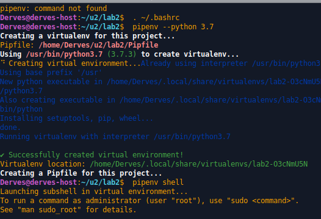
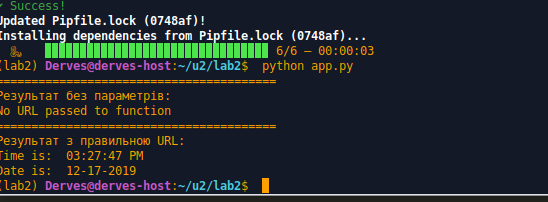
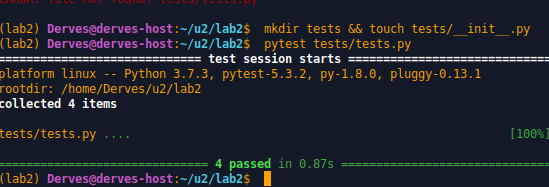
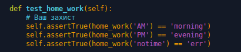
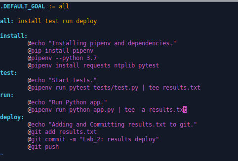

# Lab_2: Автоматизація. Знайомство з CI/CD.

1. Створив папку з readme файлом.
2. Інсталював pipenv за допомогою `pip`. Створив ізольоване середовище для Python.

3. Встановив бібліотеки `requests` та `ntplib` командою `pipenv install`.
4. Створив `app.py` та скопіював туди код з репозиторію. Ознайомився з Python Tutorial.
5. `python app.py`:

6. Встановив бібліотеку `pytest`. Ознайомився з документацією.
7. Запустив тести:

8. Дописав у програмі функцію для друку привітання.

9. Написав тест для перевірки даної функції на правильність виконання.

10. Перенаправив вивід тестів та пррограми у файл `results.txt` Зробив це командою перенаправлення потоку виводу `>` для перезапису файлу та `>>` для допису в кінець файлу.
11. Зробив коміт.
12. Заповнив Makefile.

13. Закомітив зміни та перейшов на віртуальну машину.
14. Склонував репозиторій. Перейшов у папку та запустив `make`:
