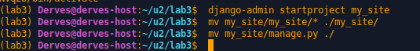
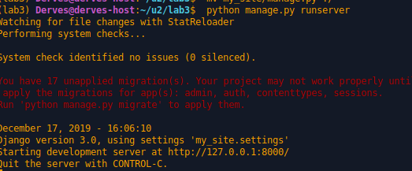

# Lab_3: Вступ до моніторингу.

1. Створив папку з лабораторною. Інійціалізував там pipenv середовище. Встановив необхідні пакети.
2. Створив заготовку за допомогою Django-framework:

3. Переконався що сервер запускається нормально:

4. Зупинив сервер та створив коміт з базовим темплейтом. Створив файл `.gitignore`, щоб git не додавав `db.sqlite3` до коміту.