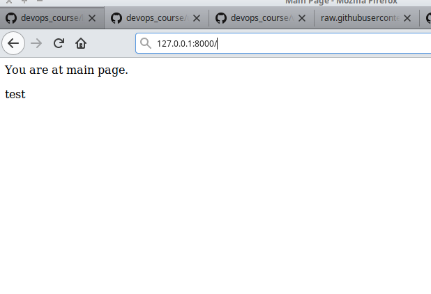
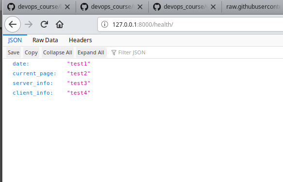
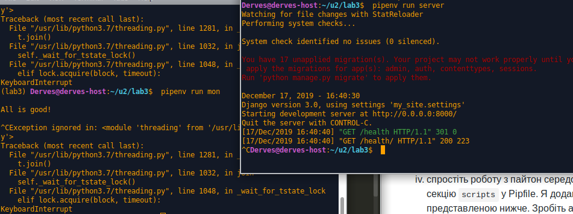

# Lab_3: Вступ до моніторингу.

1. Створив папку з лабораторною. Інійціалізував там pipenv середовище. Встановив необхідні пакети.
2. Створив заготовку за допомогою Django-framework:

3. Переконався що сервер запускається нормально:

4. Зупинив сервер та створив коміт з базовим темплейтом. Створив файл `.gitignore`, щоб git не додавав `db.sqlite3` до коміту.
5. Створив темплейт додатку `main`. Створив коміт.
6. Створив папку `main/templates` та файл `main.html` у цій папці. Також створив ще один файл `main/urls.py`. Зробив коміт.
7. Вказав Django що шукати сторінки потрібно у у додатку `main`, вказав у файлі `my_site/setting.py` у директиві `INSTALLED_APPS`, вніс зміни у файл `my_site/urls.py`.
8. Ознайомився з файлами.
9. Заповнив файл `main/urls.py` згідно зразка.
10. Запустив сервер:


11. Створив файл `monitoring.py`. Встановив `requests` бібліотеку.
12. Сторінка відкривається успішно.
13. Захист:
- Модифікував функцію `health` щоб у відповіді були: згенерована на сервері дата, URL сторінки моніторингу, інформація про сервер на якому запущений сайт та інформація про клієнта який робить запит до сервера;
- дописав функціонал який буде виводити повідомлення про недоступність сайту у випадку якщо WEB сторінка недоступна
- зробив так, щоб дана програма запускалась раз в хвилину та працювала в бекграунді
- спростив роботу з пайтон середовищем через швидкий виклик довгих команд, додав аліас на запуск сервера та на запуск моніторингу:
``` Bash
pipenv run server
pipenv run mon
```
14. Запустив сервер та переконався у його працездатності:

-Закомітив файл логів.