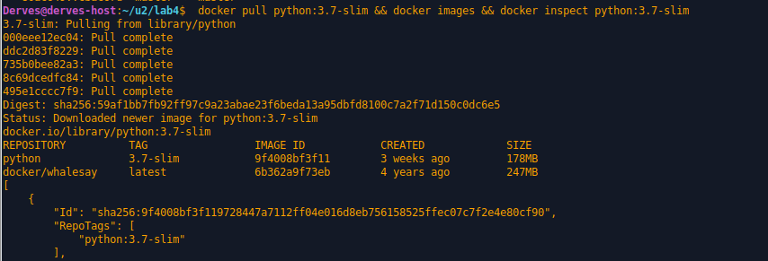
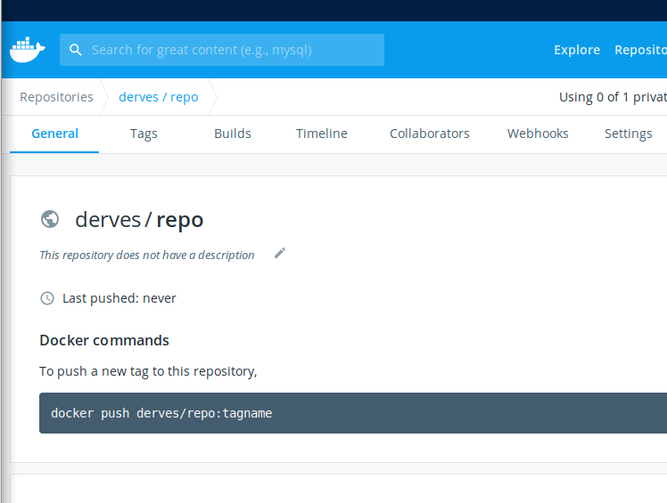
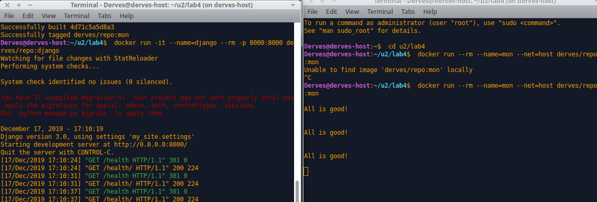

# Lab_4: Робота з Docker

1. Ознайомився з документацією Docker
2. Запустив команди та перенаправив їхній вивід у файл `my_work.log`. зробив коміт.
3. Ознайомився з документацією.
4. Завантажив базовий імедж з репозиторію.

- Створив Dockerfile та скопіював вміст з репозиторію.
- Ознайомився з цим файлом
- Замінив посилання на власні та зробив коміт.
5. Створив власний репозиторій на Docker Hub.

6. Виконав білд імеджа та завантажив його до репозиторію.
``` Bash
docker build -t derves/repo:django .
docker images 
docker push derves/repo:django
```
- Посилання на репозиторій: [DOCKER_HUB](https://hub.docker.com/r/derves/repo)
7. Виконав команду для запуску веб-сайту:
`docker run -it --name=django --rm -p 8000:8000 derves/repo:django`
8. Створив ще один контейнер із програмою моніторингу веб-сайту:
- Створив Dockerfile
- Виконав білд
- Запустив 2 контейнери одночасно:

- Дістав логи з контейнера та зробив коміт.