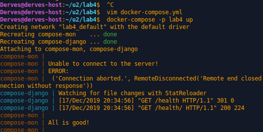

# Lab_5: Автоматизація за допомогою Makefile VS Docker Compose

1. Прочитав про Docker-Compose.
2. Прочитав про flask
3. -
4. -
5. Створив папку `my_app`, `tests`. Скопіював файли з репозиторію у папки. Файл `requirements` містить список бібліотек для pipenv: redis, flask, requests, pytest
6. Перевірив проект на працездатність. Не всі тести відпрацювали успішно:

7. Видалив файли після створення тестового середовища. Створив два файли `Dockerfile` та `Makefile`.
8. Ознайомився зі вмістом файлів. Директиви `Makefile`:
- 
- Директиви:
  1. (1) - Присвоєння імен цілей змінній STATES
  2. (2) - Присвоєння назви репозиторію
  3. (4) - Директива для зазначення цілей як фіктивних (цілі не являються файлами)
  4. (6) - Директива визначає команди які необхідно виконати для цілей, які зберігаються у змінній `STATES`. `$@` - в конкретному випадку містить назву цілі для якої виконується команда.
  5. (7) - Створення імеджу для цілей
  6. (9) - ціль для запуску контейнерів для роботи сервера
  7. (10) - створюємо мережу `appnet` для взаємодії між сервером та сервером сховища
  8. (11-12) - запускаємо контейнери серверу сховища та додатку
  9. (14) - ціль для запуску контейнера тестів
  10. (15) - запуск контейнера з тестами
  11. (17) - ціль для очистки ресурсів docker'a
  12. (18-22) - видалення `запущених процесів докера`, `запущених контейнерів`, `сховищ`,  `мереж`, `імеджів`

9. Створив імеджі використовуюючи `make`. Змінив репозиторій. Запустив паралельно додаток та тести:
- Зробив скріни сторінок:
- 

10. Почистив всі ресурси за допомогою `make`
11. Створив директиву Makefile (`docker-push`) для завантаження створених імеджів у репозиторій. Завантажив створені імеджі до свого репозиторію
12. Видалив створені та закачані імеджі. Створив для цього директиву Makefile - `docker-trash`.
13. Створив файл `docker-compose.yml` та заповнив вмістом. Дві мережі використовуються для групи контейнерів та для обмеження доступу інших контейнерів до тих, до яких не має бути доступу.
14. Запустив docker-compose;
15. Сайт працює, необхідно просто перейти на `localhost` (порт 80).
16. Змінив теги та перезапустив docker-compose.
17. Зупинив проект та почистив ресурси.
18. Завантажив створені імеджі до репозиторію.
19. На мою думку універсальним буде використання `Makefile`, але для роботи з docker звісно ж краще використовувати `docker-compose`. Все залежить від мети для якої необхідно автоматизувати процес розгортання.
20. Створив `docker-compose` для своєї 4-ї лабораторної.
