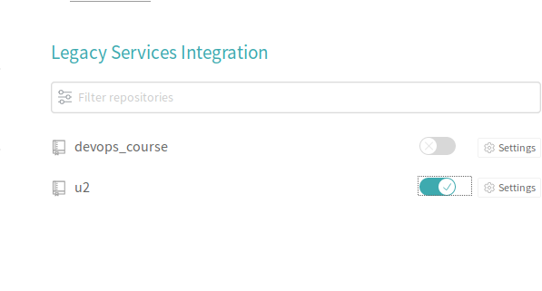

# Lab_6: Автоматизація за допомогою CI/CD серверів.

1. Переглянува стартову сторінку Travis.
2. Переглянув документацію
3. Додав репозиторій до Travis:

4. Створив `.travis.yml`, скопіював туди вміст з репозиторію.
5. Прочитав документацію.
6. Переписав білди.